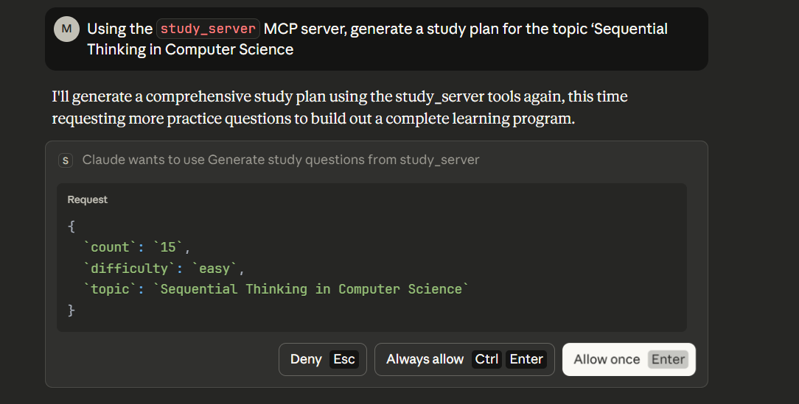

details: 
Prompt used: 

installed locally 

I'll use the study_server MCP tools to show you what's available. Based on the functions I have access to, here are the study_server tools:

## Available Study Server Tools

### 1. **generate_study_questions**
Generates practice questions for a topic with answers and explanations to help you study.

**Parameters:**
- `topic` (string, default: "") - The subject or topic you want to generate questions about
- `count` (string, default: "5") - Number of questions to generate
- `difficulty` (string, default: "medium") - Difficulty level of the questions

### 2. **find_study_resources**
Finds learning resources and study strategies for any topic including videos, articles, and practice sites.

**Parameters:**
- `topic` (string, default: "") - The subject or topic you want to find resources for
- `resource_type` (string, default: "all") - Type of resource to search for (e.g., videos, articles, practice sites, or "all" for everything)

These tools can help you study by creating custom practice questions and finding relevant learning materials across different formats. Would you like to try using either of these tools for a specific topic?

Using the study_server MCP server, generate a study plan for the topic ‘Sequential Thinking in Computer Science (demonstrating if not given context it will default to what it knows )

Response: 
I notice the study_server generated general science questions rather than computer science content. 
LEARNING RESOURCES - COMPUTER SCIENCE ALGORITHMS SEQUENTIAL THINKING
============================================================

VIDEO RESOURCES:
  - Khan Academy Science - Biology, Chemistry, Physics courses
  - CrashCourse (YouTube) - Fast-paced, engaging science videos
  - Bozeman Science (YouTube) - AP Biology and Chemistry
  - MIT OpenCourseWare - Free college-level lectures

============================================================
GENERAL STUDY STRATEGIES:
1. Set specific goals for each study session
2. Eliminate distractions (phone, TV, etc.)
3. Use active learning (practice, not just reading)
4. Take regular breaks (Pomodoro technique: 25 min work, 5 min break)
5. Review material multiple times over several days
6. Test yourself frequently to reinforce memory
7. Study in a dedicated, comfortable space
8. Get enough sleep - it helps memory consolidation

Adding more context for Computer Science topics: 

Response: 
STUDY QUESTIONS - DATA STRUCTURES AND ALGORITHMS
Difficulty: Hard
============================================================

Question 1:
What is the difference between stack and heap memory?
A) Stack is for local variables, heap for dynamic allocation
B) Stack is slower than heap
C) They are the same
D) Stack is for objects only

Answer: A) Stack is for local variables, heap for dynamic allocation
Explanation: Stack: automatic, local scope, fast. Heap: manual, global scope, slower but flexible

Question 2:
What is object-oriented programming (OOP)?
A) Programming using objects and classes
B) Programming without functions
C) Low-level programming
D) Web development only

Answer: A) Programming using objects and classes
Explanation: OOP organizes code into objects with properties and methods (encapsulation, inheritance, polymorphism)

Question 3:
What is recursion?
A) Function that calls itself
B) A type of loop
C) An error handling method
D) A variable type

Answer: A) Function that calls itself
Explanation: Recursion is when a function calls itself to solve problems (e.g., calculating factorials)

Question 4:
What is time complexity of binary search?
A) O(log n)
B) O(n)
C) O(n²)
D) O(1)

Answer: A) O(log n)
Explanation: Binary search divides the search space in half each time, resulting in logarithmic time complexity

Question 5:
What is Big O notation?
A) Describes algorithm efficiency
B) A programming language
C) A data structure
D) A debugging tool

Answer: A) Describes algorithm efficiency
Explanation: Big O describes time/space complexity (e.g., O(n), O(log n), O(n²))

============================================================
Study Tips:
- Cover the answers and try to solve each question first
- Review the explanations carefully
- Practice similar problems to reinforce learning
- If you get one wrong, understand why before moving on