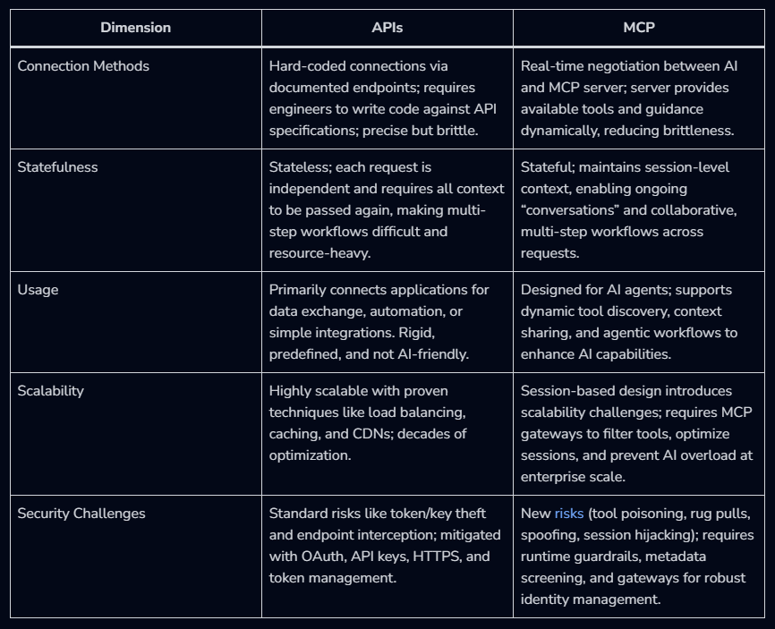
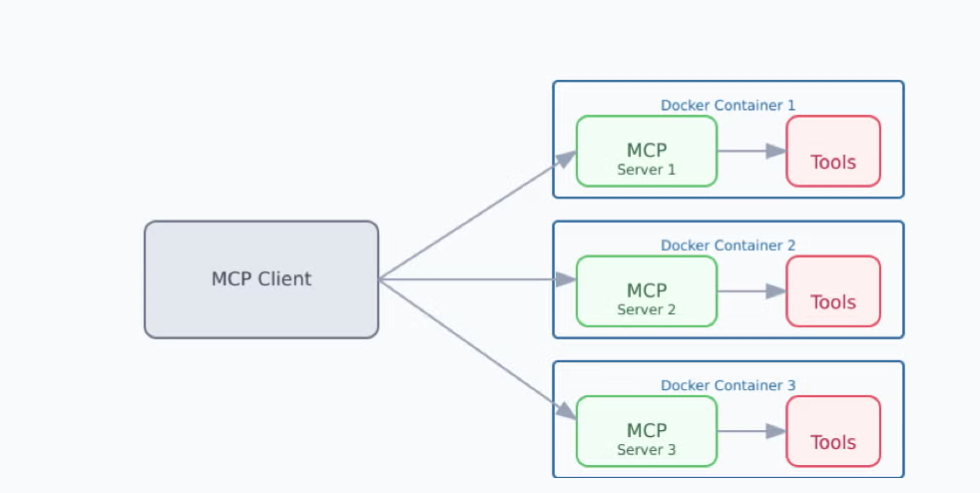

# Directed-Study-MCP Servers 

## Introduction 
This directed study explores the local and cloud deployment of Model Context Protocol (MCP) servers, focusing on evaluating available MCP server implementations and leveraging AI to develop customized MCP solutions. The study includes hands-on experimentation with Docker-based MCP tools, Google ADK, and other MCP server management platforms. Evaluation centers on performance, scalability, and security trade-offs, with an MCP prototype implemented and tested in both local and cloud environments to assess how infrastructure impacts system efficiency and cybersecurity. As organizations increasingly migrate from on-premise data centers to cloud infrastructures, this project aims to identify the optimal operational environment for MCP servers. Throughout the report, the configuration steps, AI-driven tool development, and results from testing multiple MCP server frameworks are documented to provide comprehensive insights into deployment practices and recommendations.
Model Context Protocol (MCP) servers are key components in modern AI systems, acting as gateways between large language models (LLMs) and the external context or capabilities they require to deliver meaningful interactions. An MCP server standardizes how data flows, context is maintained, and external resources are queried by connected clients.
The scope of this project includes:

- Designing and implementing MCP servers according to industry standards.​
- Hosting servers on both local hardware and in a cloud environment.
- Testing containerized MCP servers.
- Utilizing custom prompts to deploy an MCP server.
- Comparing scalability, latency, and maintenance requirements for each deployment.
- Measuring the cost, reliability, and security of each hosting approach for representative AI application use cases.​

## Key Functions of an MCP Server 
- Context Management: Maintains a consistent context state for each session, allowing the AI model to track ongoing conversations and relevant data.​
- Data Synchronization: Ensures data consistency by propagating updates between clients and the server, and supports both real-time and batch modes.​
- Request Routing: Directs incoming function requests to appropriate compute resources, APIs, or tools on the server.
- Authentication and Access Control: Employs mechanisms such as OAuth, API keys, and role-based policies to secure access and data exchange.​
- Logging and Monitoring: Captures system metrics, usage events, and health checks for operational oversight and auditing.​
- Error Recovery: Supports strategies for failover, message retries, and context restoration after disruptions.​

## Limitations and Considerations 
- Security Architecture Weakness: MCP initially lacked an authentication/authorization framework, since then these features have been added, but there are still concerns from implementors what the MCP server often plays the authorization and resource server (Example: validating tokens and serving resources) which violates separation-of-concerns. 
- Tool & Context Safety Risks: the protocol allows external “tools” (resources/functions exposed via MCP) to be registered with minimal constraints. A tool can masquerade as a safe operation (e.g., write_secure_file(...)) but actually perform unauthorized or dangerous actions (e.g., data exfiltration).
- LLM / Context Window: reading many documents via multiple tool calls can hit context-window limits, latency problems, and reasoning breakdowns.
- User Experience and Transparency Challenges: For many non-technical users, the sequence of tools and resources invoked through MCP can be difficult to understand. When the system reports something like “Calling Tool X with argument Y,” the user may not realize what data is being accessed, where it is being sent, or who might gain visibility into it. This lack of clarity can undermine trust and raise privacy concerns.

## Parts of MCP Architecture: 
### The Client
The LLM itself. ChatGPT, Claude. 
### The Gateway & Flow 
We can think of the gateway as a middle man that sits between the client and the server. It receives the request, runs the tools, and sends back results in a format the client understands utilizing stdin/stdout pipes. 

How the flow works: 
1. The MCP client, creates a structured JSON payload that includes the tool to invoke, parameters, context, metadata such as authentication tokens, session data. 
2. The MCP client sents this payload to the MCP gateway. Example: 
```json
{
  "type": "call_tool",
  "tool": "list_files",
  "arguments": { "path": "/home/user" }
}
``` 
It doesnt use HTTP routes, no REST endpoints, no URL parameters. Just structured JSON messages 
3. The gateway logs, authorizes, and validates the request.
4. The gateway routes the request to the correct MCP server/servers. The gateway maintains and updates the context state across calls, enabling multi-step and multi-server workflows. The gateway logs this transaction.
5. The MCP server processes the request and creates an MCP-compliant response, adding metadata and updated context.

Often times, the MCP gateway gets confused with the MCP proxy. The MCP proxy is a simpler component that acts like a messenger taking requests from the client and then sending the to the right MCP server. The key difference is that a proxy gives lightweight, fast connectivity and flexible bridging between local and remote environments, while a gateway adds governance, compliance, and visibility on top of that connectivity, making it better suited for enterprise-wide, multi-team deployments. These do not need to be implemented simultaneously. For example, a developer running local MCP servers inside a desktop client often skip gateways or dedicated proxies entirely, while larger or multi-team enterprise environments typically introduce them later to manage scale, governance, and remote access.

### Why does MCP doesn't use APIs? 
The API defines what endpoints you can call and how you can call, and then you get a response back. There is a wide variety of ways to do it. Multiple protocols or formats cam be used, you could get resonses back in JSON, or XML. 

MCP is different because it is more dynamic. The documentation for a tool is not something you read in advance; instead, it is sent automatically during the handshake that happens when the connection starts. 

Analogy: With MCP, you don’t read documentation and then write code that calls the documented API. That’s how traditional API integrations work: you study the docs, then tailor your code to match them.
MCP solves this differently—its documentation comes through the wire. The AI receives tool descriptions as part of the connection itself, so MCP becomes “documentation + invocation” packaged together.

Here’s what happens during an MCP connection:

The client connects and says:
“I am Claude version X, and I support these capabilities.”

The server responds:
“Hello, I am Puppeteer version X, and here is the list of tools I provide.”

The client then asks for details about those tools.

The server replies with a set of tools and descriptions.

This interaction model is very different from traditional APIs, and that’s where the distinction comes from. MCP tools are self-describing and discovered dynamically, instead of requiring human-written documentation and manual integration work.



### The Server
The piece that processes requests, keeps track of ongoing conversations or tasks, and coordinates with other tools or services as needed routed by the MCP gateway. It coordinates with back-end tools, data sources, and other services, then packages the result in a form the client can use.

## Containeraized MCP Architechture 
MCP servers are packaged as containers. This allows to just run a container rather than spending time installing dependencies and configuring the runtime. Docker MCP allows the selection of an MCP client. For this assignment, I am using Claude desktop to serve as the interface to talk to the MCP servers I’ve installed through Docker Desktop. There are multiple MCP clients to select from. These MCP servers provide capabilities like accessing files, databases, creating custom servers, typically using JSON over either local (stdio) or remote (HTTP) transports. 




How the process works is the client connects to each configured MCP server. When prompting we can specify which tool or server to use. Then the client will query its available tools/capabilities to process, interacts with external systems if needed, and returns the result in natural language. 

Docker MCP architecture allows for strong security and isolation. Every time we run an MCP server with docket its going to run the mcp gateway and then run the specific mcp server. Using standard input and output and JSON RPC is changed through pipes. No need for network overhead. 
Example of running an MCP server tool and verifying a container is running simultaneously. 
 

Docker MCP gateway differs in the way we dont need to modify out client’s config for each service we run. The gateway comes in as docker, and we can configure multiple servers in docker providing secure, centralized management configuration so instead of having to configure multiple services per client, we only configure one connection that gives us access to a lot of other mcp servers. It is a lot cleaner and easier to keep track and maintain. 

## Remote MCP Architecture 
When an MCP server is hosted remotely rather than a local machine, the protocol shifts away from stdin/stdout pipes and instead uses standard web technologies for transport.
When the client sends requests to the remote MCP server, it does so over HTTPS where MCP JSON messages are sent inside encrypted POST requests, and authentication is enforced through mechanisms such as API keys, OAuth tokens, or service credentials. This makes remote MCP behave a lot like a typical web application backend.

Remote MCP deployment mirrors the structure of a typical HTTP server:
1. A public https endpoint 
2. Authentication layer 
3. Load balancer 
4. Firewall/ vpc security rules 

### Difference between remote MCP and local 
| Category     | Local MCP                                    | Remote MCP                                      |
|--------------|-----------------------------------------------|--------------------------------------------------|
| **Transport** | stdio pipes, Unix sockets, WebSockets         | HTTPS for client → server, SSE for server → client |
| **Setup**     | Runs directly on a user’s workstation         | Deployed like a cloud/web service                 |
| **Security**  | Relies on local OS permissions                | Uses cloud security layers (TLS, IAM, OAuth, VPC rules) |
| **Complexity**| Simple to run; minimal infrastructure         | Requires infrastructure + DevOps maintenance      |
| **Uses**      | Personal tools, local filesystem access       | Enterprise systems, shared services, scalable workloads |

## Conclusion 
Overall, this directed study shows that MCP is a powerful and a reasonable option for enterprise AI integration. It offers a standardized, self describing protocol that simplifies tool discovery, and I can see it reducing the overhead of traditional API-based development. MCP gateways ith their built-in governance, auditing, and context management, make them better suited for large organizations that need centralized control across many teams, while MCP proxies offer lighter, faster connectivity for remote or distributed deployments. Although MCP is highly promising, enterprise adoption still faces challenges: running MCP servers or gateways on local user workstations introduces security risks, operational inconsistency, and maintenance burdens; the protocol’s evolving authorization model and risk of unsafe tool. 
Containerized deployments in platforms like Docker mitigate many of these issues by offering isolation, centralized configuration, and reproducibility, and cloud environments further improve scalability and reliability. In conclusion, MCP is well-positioned for enterprise use—especially in controlled, containerized, or cloud-managed settings but organizations must account for its current limitations and operational complexities when deploying it across their environments.

## References 
[1] Legit Security. 2025. *What’s an MCP Server? Model Context Protocol Explained.*  
    Retrieved August 18, 2025 from  
    https://legitsecurity.com/blog/whats-an-mcp-server-model-context-protocol-explained

[2] Model Context Protocol Project. 2025. *Architecture overview - Model Context Protocol.*  
    Retrieved June 17, 2025 from  
    https://modelcontextprotocol.io/docs/architecture-overview

[3] Anthropic. 2024. *Introducing the Model Context Protocol.*  
    Retrieved November 24, 2024 from  
    https://www.anthropic.com/index.html#model-context-protocol

[4] Descope. 2025. *What Is the Model Context Protocol (MCP) and How It Works.*  
    Retrieved September 4, 2025 from  
    https://descope.com/resources/model-context-protocol-explained

[5] MCP Cloud. *AI Model Context Protocol Server Platform - MCP Cloud.*  
    Retrieved from  
    https://mcp-cloud.ai/platform

[6] Microsoft. 2025. *Model context protocol bindings for Azure Functions - Microsoft Learn.*  
    Retrieved October 13, 2025 from  
    https://learn.microsoft.com/en-us/azure/azure-functions/model-context-protocol

[7] Stainless MCP Portal. 2025. *Local MCP vs Remote MCP.*  
    Retrieved November 11, 2025 from  
    https://portal.stainless.com/docs/mcp/local-vs-remote

[8] Cline Docs. 2025. *MCP Overview.*  
    Retrieved August 19, 2025 from  
    https://docs.cline.bot/mcp-overview

[9] MCP Manager. 2025. *MCP vs API: Key Differences.*  
    Retrieved from  
    https://mcpmanager.ai/blog/mcp-vs-api/#:~:text=Key%20Takeaway%3A%20Connecting%20AI%20agents,the%20AI%20in%20it%20work

[10] MCP Manager. 2025. *Understanding MCP Gateways.*  
    Retrieved from  
    https://mcpmanager.ai/blog/mcp-gateway/#understand-mcp-gateways-with-this-webinar
